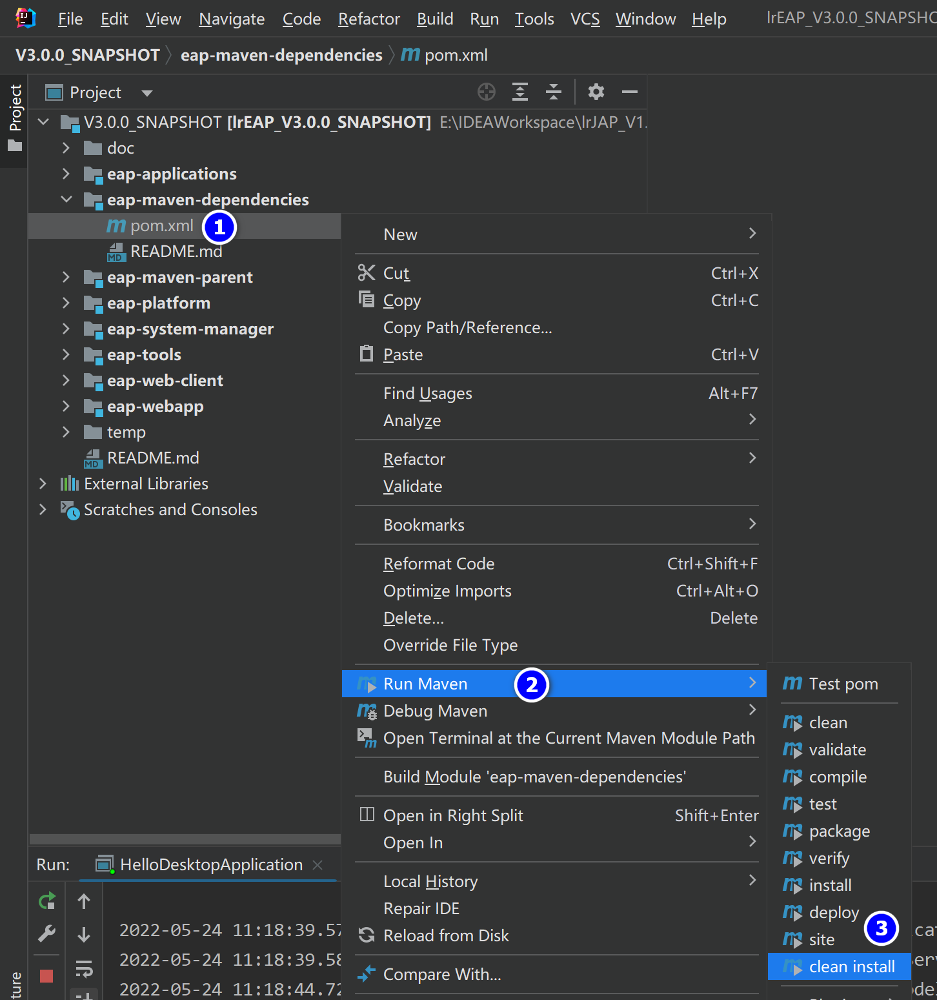
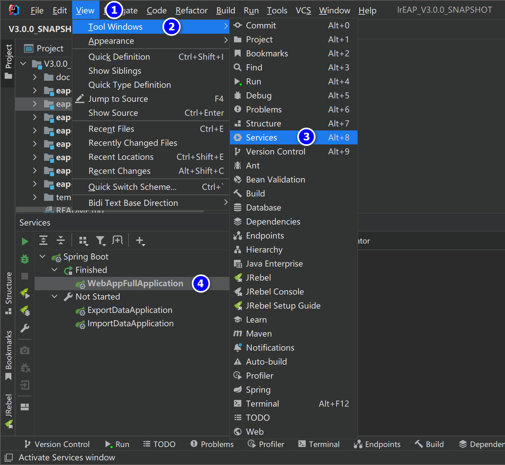
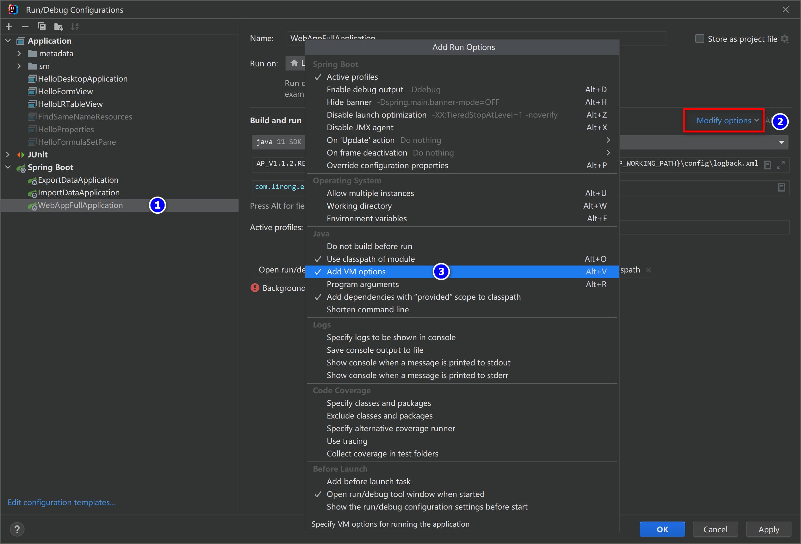
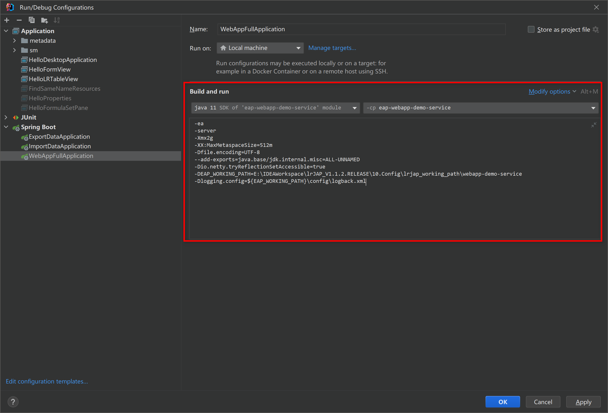
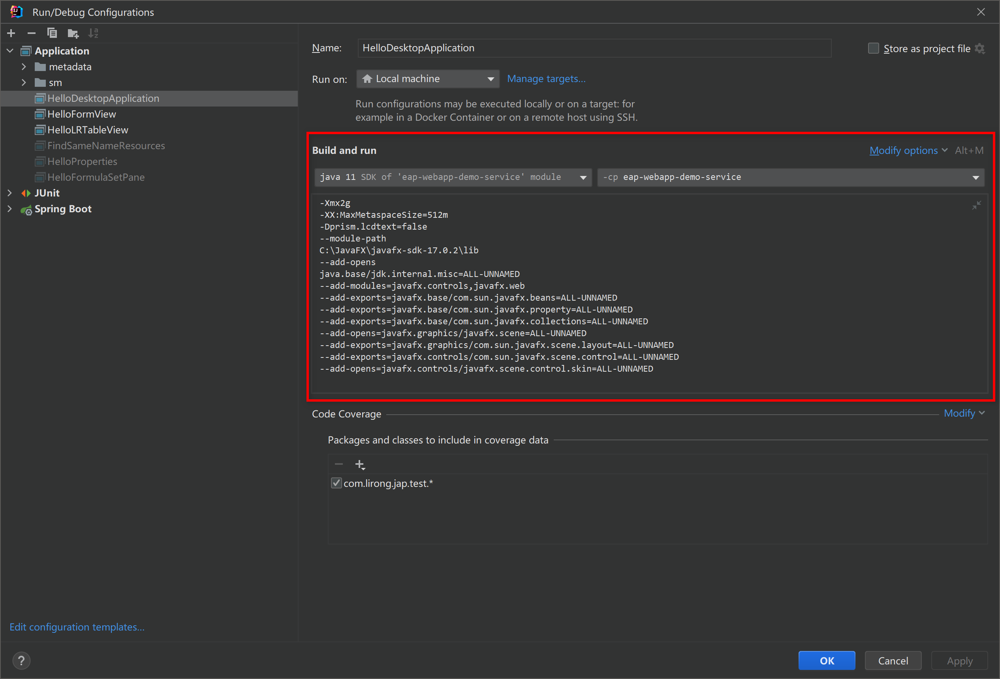
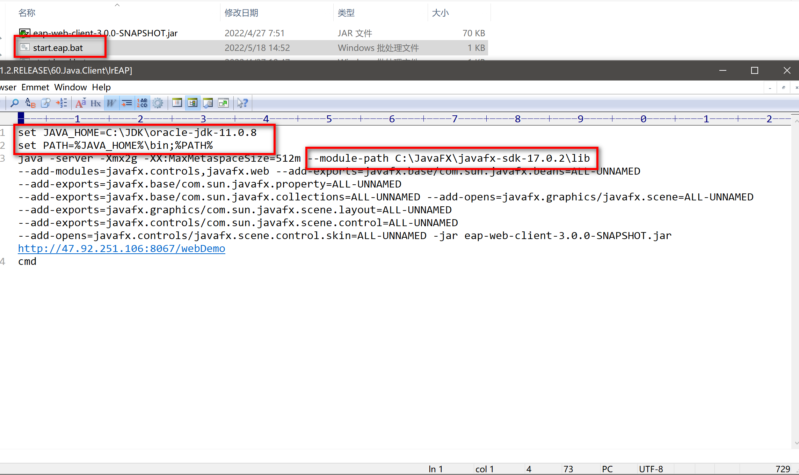
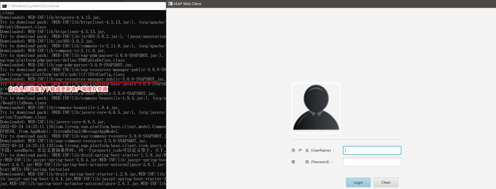
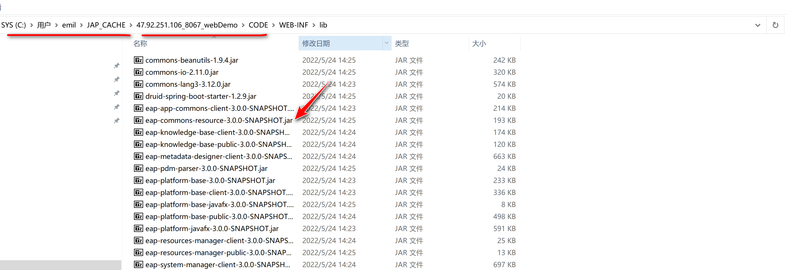

# lrEAP企业级开发平台


## 平台应用演示

基于lrEAP模式化开发的演示系统。

<video id="video" controls="" preload="none">
    <source id="mp4" src="doc/video/01.mp4" type="video/mp4">
</video>

## 平台简述

有感于一些软件公司由于平台化、模式化方面的欠缺，开发人员实现并维护一个简单的管理型界面，往往需要数天的时间。前后端代码动辄几百行甚至数千行，并由此导致效率、维护等方面一系列的问题。

对此，我们的愿景或基本要求是：以实现一个中等复杂程度的一主一子型（即一张主表、一张子表）的管理功能为例，**在需求明确并完成需求反讲等控制环节，可以开始编码的基础上，一个熟手应该在2个工时内就能够完成数据库设计、生成业务逻辑处理、界面展现等相关的框架性代码，与业务处理无关的手工代码量应该尽量少，可运行并具备基本的增删改查功能。对于一个新手，经过1-2周的培训，也能够以较快的速度完成一般复杂程度的业务功能的开发。**

lrEAP用于验证上述愿景的可行性。**在基于平台+模式化开发体系的支撑下，开发人员应该把主要精力放在实现业务逻辑上**。软件公司或是编码人员的本质工作是什么？我们认为是**解决客户的问题，满足客户的需求**。

这是我写这些文字和代码的初衷，也是lrEAP平台的主要源头。希望我的这些文字和代码，可以给面临项目交付压力的企业和开发人员一些有益的启迪和帮助。

## 目标

 lrEAP是一个基于Java、借鉴我们以往接触以及了解到的企业级应用开发思想及经验、整合第三方成熟的技术框架及工具，产生的企业级应用开发平台。编写该平台主要的技术目标，是尝试使企业应用的开发过程标准化、模式化，使开发人员把精力集中在实现业务逻辑上，减少代码量，降低开发以及维护的成本，达到以下基本目标：

- 提供自成体系、模式化的企业级应用开发思想、方法论、相应的规范和工具集，实现针对已知的绝大多数业务场景的模式化开发。lrEAP不仅仅是一堆代码，还包括思想、规范、工具集、最佳实践等内容。
- **基于JavaFX**，实现基于领域建模的代码自动生成，生成从UI到持久化所有相关的代码和配置信息，实现针对绝大多数业务场景的可视化开发。在此基础上进一步完成业务逻辑处理等相关的代码开发工作，以减少手工代码量、提高开发效率、降低开发难度和维护成本。例如，对于比较简单的只有增、删、改、查功能的管理型界面。“不写代码”从来都不是我们的重点或目标，恰恰相反，我们一直鼓励开发人员多“手办”代码，因为我们认为，所谓的高手、牛人，在成长的过程中，都逃不过“久病成医”和“熟能生巧”的宿命。所谓的神乎其技，无它，唯熟耳。
- 持久化方面，基于MyBatis，结合lrEAP的Value Object(VO)体系，实现高效、易用的O-R Mapping机制，减少与数据操作相关的代码、配置文件以及SQL等配置信息。lrEAP持久化的目标，是以MyBatis(直接、少量SQL语句)的**性能**，达到Hibernate(VO映射)的**易用性**。包括便于前台界面展现、中间件业务逻辑处理及持久化、其它方面数据交互等方面的易用性。这是lrEAP基础价值的重要体现。
- 实现模式化开发所需要的平台级的基础架构，包括元数据管理等。
- 实现系统管理相关的基础功能，包括机构管理、功能权限管理（用户、角色、权限等）、数据权限、按钮权限等。
- 实现应用层面基础的功能及组件，包括声明式事务、远程调用、安全体系、日志体系、工作流等基本功能及组件，减少冗余代码和技术耦合。
- 充分利用主流的、经过项目验证的第三方技术，提高开发的便捷性、规范性，降低开发难度。工具能够提升效率。
- 提供尽量多的基础应用级组件及开发模式，方便开发人员快速实现常见的通用业务需求，如可视化流程定义、公式编辑以及解析器、文件交换组件、任务体系、国际化体系、通用查询组件、模板处理、指标体系、业务锁机制、文档处理组件等，以提高复用程度，提升开发效率，降低开发难度和维护成本，加快业务功能的交付速度和质量。这是lrEAP平台在应用层面最主要的关键目标。
- 继承并发扬以往的企业级应用开发经验，减少业务风险、提升平台性能、降低开发及维护的复杂度

## 平台框架


### UI（客户端/界面）

以JavaFX为主要UI框架，采用命令行方式启动，基于Spring Http Invoker与服务端进行数据交互，自动从服务端下载相关代码及资源。

### Application（应用端/中间层/业务处理）

在业务逻辑层，支持基于BusinessObject(BO，业务处理对象)的模式化开发。远程调用方面，原先使用Spring Http Invoker，目前已经改为使用Dubbo。

### DataBase（数据库）

根据我们的观察，一般情况下，开发人员可能比较关注应用端业务逻辑的实现，或者是关注UI端界面的展现及交互，对数据库层面投入的关注度反而不高。对此我们有一些不同的理解，套用《极限特工》中那句经典的台词，我们可以这样表述：**应用来了又去，而数据永存。**基于关系型数据库的企业应用系统，所有的业务功能、业务逻辑，都是对数据的处理及运用。我们认为，在企业级应用系统中，如果一定要说哪个组成部分最重要，那么一定是数据库——或者说是数据。对于金融行业客户那就尤为明显了，那些老牌的金融企业最宝贵的历史资产是什么？是那庞大的客户群历年生成的各种各样的数据。

业务功能产生数据可能只是一瞬间，但这些业务数据却需要在相当长的时间内进行存储和被运用。所以我们建议，要以提高数据使用的便捷性、高效性为第一目标，结合数据更新以及保存的要求，进行数据的物理结构设计。例如，数据将怎样被使用？需要对访问者进行哪些限制？是否需要单独的存储介质？是否需要进行表分区？选用堆表还是索引组织表？等等。

## 技术选型

- 前端采用JavaFX。主要是因为对JS类框架不熟悉。但相信基本的思想都是能通用的。
- 后端主要采用SpringBoot、MyBatis、Flowable等。
- 基于Freemarker实现代码生成。
- 前后端通讯采用Spring Http Invoker。也有本地代码分支使用Dubbo+Nacos，但实际开发调试过程不如Http Invoker方便。

## 平台框架

lrEAP平台框架在逻辑上可以分为三个层次：

- 基础设施层。包括各种软硬件系统平台、数据库、中间件等。lrEAP是基于J2EE的企业级开发平台，具有跨平台的特性。操作系统方面，支持Windows、各种Linux/Unix等主流的操作系统。数据库方面，支持Oracle、DB2等企业级关系型数据库。支持各种基于J2EE规范的Web容器和商用中间件，如Tomcat、Jetty、JBoss等Web容器，WebSphere、WebLogic等企业级中间件。
- 应用框架层。应用框架介于基础设施和应用系统之间，主要作用是为应用系统提供各种基础服务，并屏蔽基础设施的异构性和复杂性。
  - **元数据框架**。元数据框架是lrEAP中重要的基础框架，它是UI框架、报表组件、国际化等应用框架和组件的基础。
  - **持久化框架**。lrEAP的持久化框架基于MyBatis和ValueObject体系，目标是使用较少的代码实现较高性能的持久化。lrEAP持久化框架最主要的基类是业务基础对象(BasicBusinessBO)。
  - **任务调度框架**。lrEAP的任务调度框架支持定时任务、条件任务、批量任务。
  - **国际化支持**。基于资源文件实现国际化，lrEAP提供国际化工具，实现基于现有代码自动替换并生成国际化资源，同时提供统一的国际化资源加载工具。
  - **UI框架**。提供基于lrEAP模式化思想的UI框架，其中包括常见的界面模式以及最佳实践。为基于业务建模的快速开发提供基础支持。
- 应用系统层。应用系统层的主要目标，是基于lrEAP模式化开发思想和工具集，高效、快速实现业务需求。
  - **业务建模**。基于业务需求，实现元数据建模、功能建模、流程建模和界面建模。
  - **模式化开发**。包括解决特定业务领域问题的思想、规范、工具集等。是lrEAP模式化开发思想的重要表现。

## 编译并运行

### 下载并配置JavaFX SDK

   - 下载地址
     https://gluonhq.com/products/javafx/

   - 解压安装

   - 配置IDEA

     参见：[lrEAP JavaFX环境配置](doc/demo/JavaFX_Env.md)

### 下载代码到本地

[lrEAP GitHub](https://github.com/lrJAP/EAP)

### 创建并初始化数据库

   可以直接使用dump文件恢复Oracle或者MySQL数据库。

   参考：[lrEAP演示环境数据库初始化](doc/demo/DataBase.md)

### 配置Maven

- 下载地址：[Apache Maven](https://maven.apache.org/)

- 解压到指定位置

- 修改settings.xml

     

- 可以为操作系统增加MAVEN_HOME参数，并把%MAVEN_HME%/bin添加到PATH参数中（以Windows为例）

  

### 把工程导入IntelliJ IDEA

   需要安装Maven Helper插件

   参考：[lrEAP演示环境IDEA初始化](doc/demo/IDEA.md)

### 编译并安装**eap-maven-dependencies**模块

   

### 编译并安装**eap-maven-parent**模块

   方式同上。

### 配置并检查参数

   - 下载[示例项目配置文件](TODO)

   - 

   - 配置文件说明

     
     
     

   - 控制台加解密工具

     ```java
     com.lirong.eap.platform.base.bs.utils.JasyptUtils
     ```

     示例：

     

   

### 运行服务端

   - 打开Service页签

     

     如果使用的是IntelliJ IDEA社区版本，则需要找到WebAppFullApplication类，在类名上右击，选择Run "WebAppFullApplication"或者"Debug WebAppFullApplication"。

   - 服务端演示启动类

   ```java
   com.lirong.eap.webapp.full.WebAppFullApplication
   ```

   - 参数配置

     - 打开配置窗口

       

     - 设置VM参数

       

     - 输入VM参数

       

   - JVM示例参数

   ```java
   -ea -server -Xmx2g -XX:MaxMetaspaceSize=512m -Dfile.encoding=UTF-8 --add-exports=java.base/jdk.internal.misc=ALL-UNNAMED -Dio.netty.tryReflectionSetAccessible=true -DEAP_WORKING_PATH=E:/IDEAWorkspace/lrJAP_V1.1.2.RELEASE/10.Config/lrjap_working_path/webapp-demo-service -Dlogging.config=${EAP_WORKING_PATH}/config/logback.xml
   ```

   EAP_WORKING_PATH需要指向服务端参数所在的目录（config子目录的上一层）。

   -Dlogging.config指定logback日志配置文件。

   - 运行服务端

     

   

### 运行客户端


- 启动类

   ```java
   com.lirong.eap.test.HelloDesktopApplication
   ```

   参数设置

   参数为服务类设置VM参数的方式。

   VM参数设置

   

   JVM参数示例

   ```java
   -Xmx2g
   -XX:MaxMetaspaceSize=512m
   -Dprism.lcdtext=false
   --module-path
   C:/JavaFX/javafx-sdk-17.0.2/lib
   --add-opens
   java.base/jdk.internal.misc=ALL-UNNAMED
   --add-modules=javafx.controls,javafx.web
   --add-exports=javafx.base/com.sun.javafx.beans=ALL-UNNAMED
   --add-exports=javafx.base/com.sun.javafx.property=ALL-UNNAMED
   --add-exports=javafx.base/com.sun.javafx.collections=ALL-UNNAMED
   --add-opens=javafx.graphics/javafx.scene=ALL-UNNAMED
   --add-exports=javafx.graphics/com.sun.javafx.scene.layout=ALL-UNNAMED
   --add-exports=javafx.controls/com.sun.javafx.scene.control=ALL-UNNAMED
   --add-opens=javafx.controls/javafx.scene.control.skin=ALL-UNNAMED
   ```

   - --module-path：指向JavaFX SDK的lib目录。
   - -Dprism.lcdtext=false：用于在高分屏(4K)中实现界面抗锯齿的效果。

   运行客户端

   

   - 演示用户

     | 用户名及密码 | 说明                   |
     | ------------ | ---------------------- |
     | admin/1      | 系统管理员，中文环境   |
     | test01/1     | 测试用户，英文环境     |
     | user01/1     | 测试用户，繁体中文环境 |

     

## 部署并运行

TODO

## 演示环境

- 下载[lrEAP演示环境的WebClient客户端](TODO)

- 配置[JavaFX SDK环境]((doc/demo/JavaFX_Env.md))

- 修改JVM参数

  

- 运行客户端

  

- 本地缓存

  


## lrEAP JavaFX开发手册

[lrEAP JavaFX开发手册](doc/javafx/README.md)，本文档描述lrEAP对JavaFX组件的扩展与增加。

## lrEAP模式化开发简介

[lrEAP模式化开发](doc/ui/README.md)，这是lrEAP中非常重要的一份文档，描述如何基于元数据结合格式化开发机制，实现功能的快速开发。

## lrEAP模式化开发主要功能描述

| <span style="display:inline-block;width:35%">功能</span> | 描述                                                         |
| -------------------------------------------------------- | ------------------------------------------------------------ |
| [枚举设计](doc/enum/README.md)                           | 基于ini文件生成自定义枚举信息，包括枚举类、json序列化/反序列化类、MyBatis Handler类，以及国际化资源信息。 |
| [参照设计](doc/reference/README.md)                      | 基于PowerDesigner或元数据，生成参照信息，包括前、后端相关代码及资源。 |
| [元数据设计](doc/metadata/README.md)                     | 基于PowerDesigner，生成单一实体、树型结构的元数据信息，包括实体信息、实体属性信息、查询条件相关的前后端代码。<br />元数据是lrEAP中最基础的公共数据，是后续聚合对象设计、多对多对象设计、单据及功能菜单开发的基础。 |
| [聚合对象设计](doc/aggregation/README.md)                | 基于元数据，设计并生成聚合对象的相关信息。支持一主一子、一主多子、多主、多主多子等复杂结构。并生成相应的前后端代码。 |
| [多对多对象设计](doc/many2many/README.md)                | 基于元数据，设计并生成多对多对象的相关信息。多对多结构中，最关键的是对照表。 |
| [资源国际化](doc/bill/README.md)                         | 对java源代码时的中文进行国际化处理。                         |
| [单据定义](doc/bill/README.md)                           | 基于元数据（包括聚合、多对多），生成界面单据信息。           |
| [功能定义](doc/function/README.md)                       | 基于单据定义，生成功能信息。                                 |
| [菜单定义](doc/menu/README.md)                           | 基于功能定义，生成菜单信息。一个功能可以生成多个菜单。       |

## 模块列表
| <span style="display:inline-block;width:35%">模块名称</span> | 描述                                                         |
| ------------------------------------------------------------ | ------------------------------------------------------------ |
| [eap-maven-dependencies](eap-maven-dependencies/README.md)   | 独立模块，用于声明 eap 平台中所有的模块，供外部类库引用。    |
| [eap-maven-parent](eap-maven-parent/README.md)               | 用于声明、管理eap平台引用的所有第三方类库，以及除eap-maven-dependencies之外所有的平台模块。 |
| [eap-web-client](eap-web-client/README.md)                   | 用于JavaFX客户端与后端服务器通讯（下载前端代码、实现前后端交互等）。 |
| [eap-platform](eap-platform/README.md)                       | eap平台基础模块，提供ValueObject、FX ValueObject、Reference参照系统、JavaFX扩展、BusinessObject体系等。 |
| [eap-system-manager](eap-system-manager/README.md)           | 系统管理、元数据管理相关的功能。                             |
| [eap-applications](eap-applications/README.md)               | 应用平台。包括通用功能、消息管理、批处理、工作流、知识管理等模块。 |
| [eap-tools](eap-tools/README.md)                             | 应用级工具。如导入导出等模块。                               |
| [eap-webapp](eap-webapp/README.md)                           | Web演示模块。                                                |
