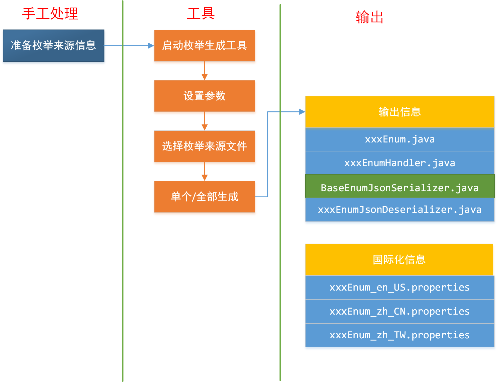
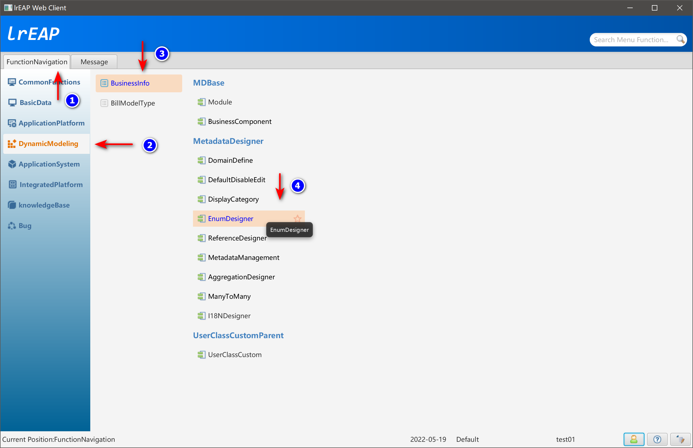
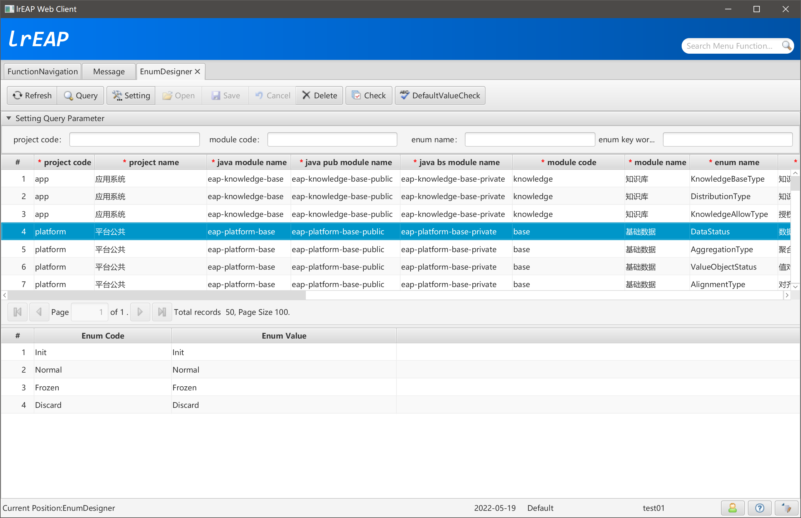
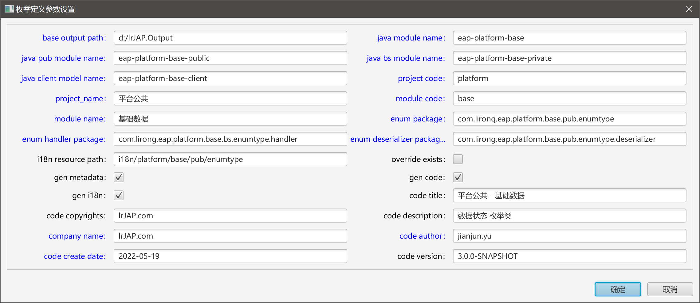
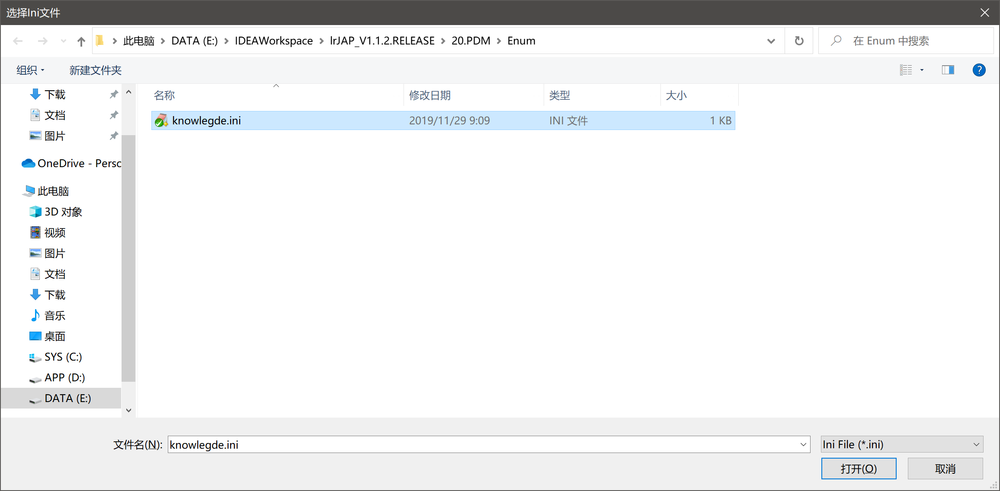
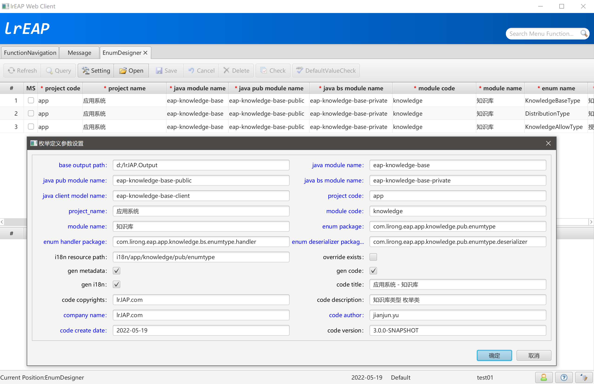
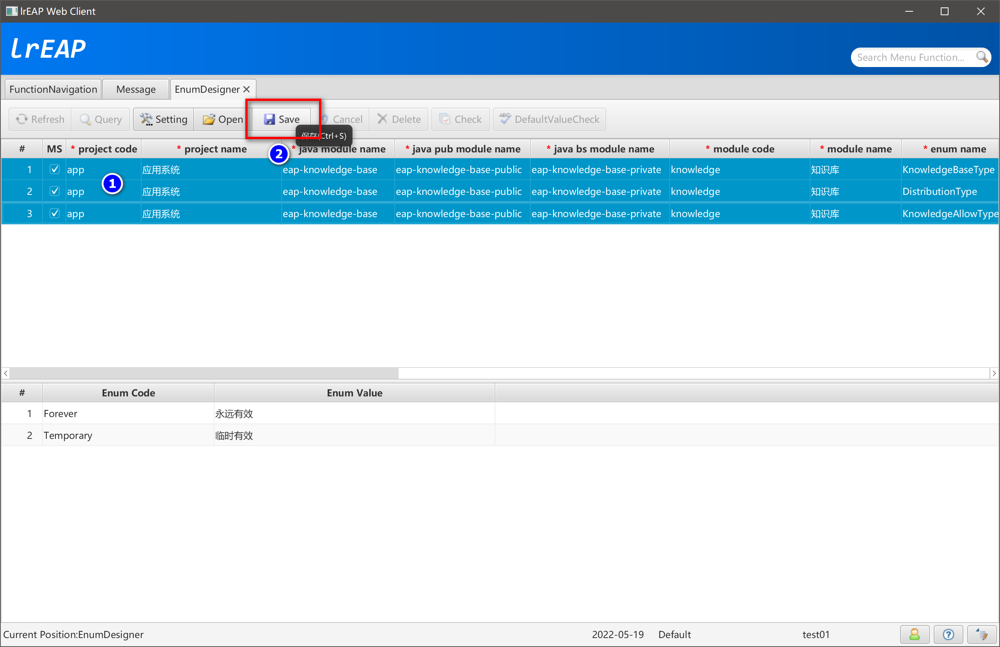

# EnumDesigner枚举定义

[返回](../../README.md)

## 简述

软件开发过程中，通常使用枚举类型来管理一组稳定的、有限的常量值，例如各种数据状态、单据状态、账户状态等信息。

在基于目前通用Java框架（如Spring + MyBatis），使用枚举类型时，开发人员往往需要编写枚举类，以及众多的辅助类，如供Spring MVC使用的Converter类、供MyBatis使用的Handler类、供Json使用的序列化和反序列化类等。企业级系统中，枚举类型的数量可能会多达数百个甚至更多，加上各种转换和处理类，如果手工编写这些代码的话，工作总量就相当可观了。

本文将说明如何使用枚举信息生成工具，自动生成枚举类及相关辅助处理类，规范枚举类的定义规则，统一管理系统中所有的枚举信息，减少开发人员重复的工作量。


## 枚举类说明

fxEAP中默认生成的枚举类信息，结构上总是包含code、value两个成员变量。采用这种结构的原因，一是希望即使枚举信息持久化到数据库后，也能够基本看出枚举数据对应的业务含义；二是有利于使用Combobox显示枚举信息；三是为报表输出、公式解析、数据导入导出等功能提供便利。

我们的目标，是能够根据简单的定义文件，通过工具生成枚举类信息，并生成与该枚举所有相关的辅助处理类，以“数据状态”枚举为例，说明Enumseed工具生成的枚举类型以及相关辅助类信息。

枚举类的code用于持久化到数据库中，value用于界面展现。枚举的code使用String类型而不是int或其它类型，主要是希望即使枚举类持久化到数据库后，也能够“看出”其表示的业务含义，“0INIT”比“0”要更直观一些——至于多占用的存储空间，就忽略不计了。以上示例中，code前面的0,1…，主要是（习惯上）为了能够根据枚举值排序，没有业务含义。

- 自定义枚举IEnumType接口

  ```java
  /**
   * <p>Title: LiRong Java Enterprise Application Platform</p>
   * <p>Description: 包括code/value属性的枚举类接口 </p>
   * CorpRights: lrJAP.com<br>
   * Company: lrJAP.com<br>
   *
   * @author jianjun.yu
   * @version 6.0.0.RELEASE
   * @date 2021-10-12
   * @see com.lirong.eap.platform.base.pub.enumtype.DataStatusEnum
   * @see com.lirong.eap.platform.base.pub.utils.IEnumTypeUtils
   * @since 1.0.0-SNAPSHOT
   */
  public interface IEnumType {
  
      /**
       * 获取枚举编码
       *
       * @return 编码，用于标识枚举值以及保存到数据库
       */
      String getCode();
  
      /**
       * 获取枚举描述
       *
       * @return 描述，用于界面显示
       */
      String getValue();
  }
  ```

  

- 数据状态（DataStatusEnum）枚举类示例

  ```java
  /**
   * <p>Title: LiRong Java Enterprise Application Platform </p>
   * <p>Description: DataStatusEnum(数据状态) 枚举类 </p>
   * <p>CorpRights: lrJAP.com</p>
   * <p>Company: lrJAP.com</p>
   *
   * @author jianjun.yu
   * @version 3.0.0-SNAPSHOT
   * @date 2022-04-19
   * @since 1.0.0-SNAPSHOT
   */
  @JsonSerialize(using = BaseEnumJsonSerializer.class)
  @JsonDeserialize(using = DataStatusEnumJsonDeserializer.class)
  public enum DataStatusEnum implements IEnumType {
  
      INIT("Init", getMessageWithJava(getResourceFileInfo(), "DataStatusEnum.Init", "初始化")), // $NON-NLS$
      NORMAL("Normal", getMessageWithJava(getResourceFileInfo(), "DataStatusEnum.Normal", "正常")), // $NON-NLS$
      FROZEN("Frozen", getMessageWithJava(getResourceFileInfo(), "DataStatusEnum.Frozen", "冻结")), // $NON-NLS$
      DISCARD("Discard", getMessageWithJava(getResourceFileInfo(), "DataStatusEnum.Discard", "作废")); // $NON-NLS$
  
      private final String code;
      private final String value;
  
      /* 用于在SQL中进行Decode */
      public static final String DECODE_SQL = "'Init', '初始化', 'Normal', '正常', 'Frozen', '冻结', 'Discard', '作废'"; // $NON-NLS$
  
      DataStatusEnum(String code, String value) {
  
          this.code = code;
          this.value = value;
      }
  
      @Override
      public String getCode() {
  
          return code;
      }
  
      /**
       * 通过国际化机制，获取当前区域需要显示的枚举值
       *
       * @return
       */
      @Override
      public String getValue() {
  
          return getMessageWithJava(getResourceFileInfo(), String.format("DataStatusEnum.%s", getCode()), this.value); // $NON-NLS$
      }
  
      /**
       * 国际化资源信息
       *
       * @return
       */
      public static String getResourceFileInfo() {
  
          return "i18n/platform/base/pub/enumtype/DataStatusEnum"; // $NON-NLS$
      }
  }
  ```

  

IEnumTypeUtils工具类提供基于IEnumType的以下方法：

1.	提供getByCode()和getByValue()这两个静态方法，用于根据code、value获取对应枚举对象。
2.	提供getAllCode()静态方法，返回包含枚举类中所有枚举值的code的String[]。
3.	提供getAll()静态方法，返回包含枚举类中所有枚举值的Enum[]。
4.	重载toString()方法，返回value，便于其它组件的处理。


## 开发流程




### 启动枚举管理工具

- 菜单位置



- 功能界面



### 参数设置



### 选择枚举来源文件

- 枚举定义的ini文件

  

- 打开文件

  

- 查看并修改相关参数

  

- 单选、多选生成枚举类

  

### 生成枚举信息

查看并复制生成的内容，以其中一个枚举类，说明生成的资源

#### KnowledgeBaseTypeEnum

```java
/**
 * <p>Title: LiRong Java Enterprise Application Platform</p>
 * <p>应用系统 - 知识库</p>
 * <p>Description: KnowledgeBaseTypeEnum(知识库类型) 枚举类 </p>
 * <p>CorpRights: lrJAP.com</p>
 * <p>Company: lrJAP.com</p>
 *
 * @author jianjun.yu
 * @version 3.0.0-SNAPSHOT
 * @date 2022-05-19
 * @since 1.0.0-SNAPSHOT
 */
@JsonSerialize(using = BaseEnumJsonSerializer.class)
@JsonDeserialize(using = KnowledgeBaseTypeEnumJsonDeserializer.class)
public enum KnowledgeBaseTypeEnum implements IEnumType {

    COMPANY_PUBLIC("CompanyPublic", getMessageWithJava(getResourceFileInfo(), "KnowledgeBaseTypeEnum.CompanyPublic", "公司公共")), // $NON-NLS$
    DEPARTMENT_PRIVATE("DepartmentPrivate", getMessageWithJava(getResourceFileInfo(), "KnowledgeBaseTypeEnum.DepartmentPrivate", "部门私有")), // $NON-NLS$
    DEPARTMENT_PUBLIC("DepartmentPublic", getMessageWithJava(getResourceFileInfo(), "KnowledgeBaseTypeEnum.DepartmentPublic", "部门公共")), // $NON-NLS$
    SEMI_PUBLIC("SemiPublic", getMessageWithJava(getResourceFileInfo(), "KnowledgeBaseTypeEnum.SemiPublic", "半公开")), // $NON-NLS$
    PERSONAL_PRIVATE("PersonalPrivate", getMessageWithJava(getResourceFileInfo(), "KnowledgeBaseTypeEnum.PersonalPrivate", "个人私有")); // $NON-NLS$

    private final String code;
    private final String value;

    /* 用于在SQL中进行Decode */
    public static final String DECODE_SQL = "'CompanyPublic', '公司公共', 'DepartmentPrivate', '部门私有', 'DepartmentPublic', '部门公共', 'SemiPublic', '半公开', 'PersonalPrivate', '个人私有'"; // $NON-NLS$

    KnowledgeBaseTypeEnum(String code, String value) {

        this.code = code;
        this.value = value;
    }

    @Override
    public String getCode() {

        return code;
    }

    @Override
    public String getValue() {

        return getMessageWithJava(getResourceFileInfo(), String.format("KnowledgeBaseTypeEnum.%s", getCode()), this.value); // $NON-NLS$
    }

    public static String getResourceFileInfo() {

        return "i18n/app/knowledge/pub/enumtype/KnowledgeBaseTypeEnum"; // $NON-NLS$
    }

    /******************************************************************************************************************/
    /********************************************** fxEAP Code Generator **********************************************/
    /******************************************************************************************************************/
}
```

#### KnowledgeBaseTypeEnumJsonDeserializer

```java
/**
 * <p>Title: LiRong Java Enterprise Application Platform</p>
 * <p>应用系统 - 知识库</p>
 * <p>Description: KnowledgeBaseTypeEnum(知识库类型) 枚举的Json反序列化类 </p>
 * <p>CorpRights: lrJAP.com</p>
 * <p>Company: lrJAP.com</p>
 *
 * @author jianjun.yu
 * @version 3.0.0-SNAPSHOT
 * @date 2022-05-19
 * @since 1.0.0-SNAPSHOT
 */
public class KnowledgeBaseTypeEnumJsonDeserializer extends AbstractEnumJsonDeserializer<KnowledgeBaseTypeEnum> {

    @Override
    public Class<KnowledgeBaseTypeEnum> getEnumClass() {

        return KnowledgeBaseTypeEnum.class;
    }

    /******************************************************************************************************************/
    /********************************************** fxEAP Code Generator **********************************************/
    /******************************************************************************************************************/
}

```

#### MyBatis Handler

```java
/**
 * <p>Title: LiRong Java Enterprise Application Platform</p>
 * <p>应用系统 - 知识库</p>
 * <p>Description: KnowledgeBaseTypeEnum(知识库类型) 枚举的MyBatis Handler类 </p>
 * <p>CorpRights: lrJAP.com</p>
 * <p>Company: lrJAP.com</p>
 *
 * @author jianjun.yu
 * @version 3.0.0-SNAPSHOT
 * @date 2022-05-17
 * @since 1.0.0-SNAPSHOT
 */
public class KnowledgeBaseTypeEnumHandler extends LRBaseTypeHandler<KnowledgeBaseTypeEnum> {

    @Override
    public Class<KnowledgeBaseTypeEnum> getEnumTypeClass() {

        return KnowledgeBaseTypeEnum.class;
    }

    /******************************************************************************************************************/
    /********************************************** fxEAP Code Generator **********************************************/
    /******************************************************************************************************************/
}
```


#### 国际化资源

- KnowledgeBaseTypeEnum_en_US.properties

  ```ini
  KnowledgeBaseTypeEnum.CompanyPublic=CompanyPublic
  KnowledgeBaseTypeEnum.DepartmentPrivate=DepartmentPrivate
  KnowledgeBaseTypeEnum.DepartmentPublic=DepartmentPublic
  KnowledgeBaseTypeEnum.SemiPublic=SemiPublic
  KnowledgeBaseTypeEnum.PersonalPrivate=PersonalPrivate
  ```

  

- KnowledgeBaseTypeEnum_zh_CN.properties

  ```ini
  KnowledgeBaseTypeEnum.CompanyPublic=公司公共
  KnowledgeBaseTypeEnum.DepartmentPrivate=部门私有
  KnowledgeBaseTypeEnum.DepartmentPublic=部门公共
  KnowledgeBaseTypeEnum.SemiPublic=半公开
  KnowledgeBaseTypeEnum.PersonalPrivate=个人私有
  ```

  

- KnowledgeBaseTypeEnum_zh_TW.properties

  ```ini
  KnowledgeBaseTypeEnum.CompanyPublic=公司公共
  KnowledgeBaseTypeEnum.DepartmentPrivate=部門私有
  KnowledgeBaseTypeEnum.DepartmentPublic=部門公共
  KnowledgeBaseTypeEnum.SemiPublic=半公開
  KnowledgeBaseTypeEnum.PersonalPrivate=個人私有
  ```

  

[返回](../../README.md)