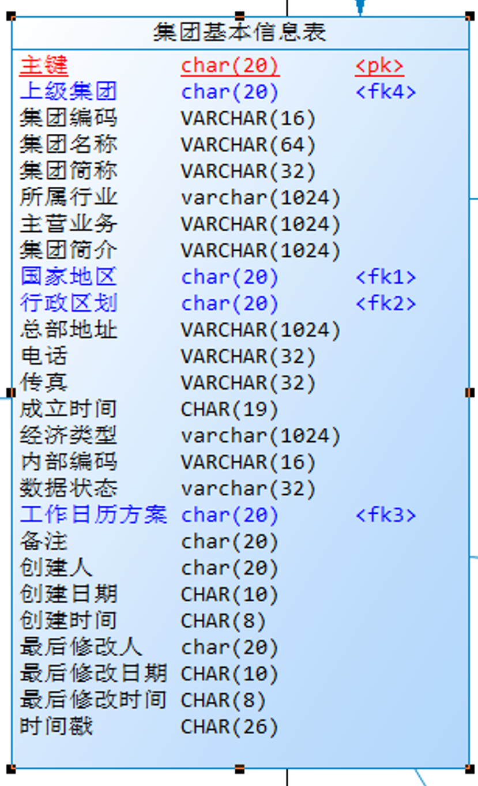
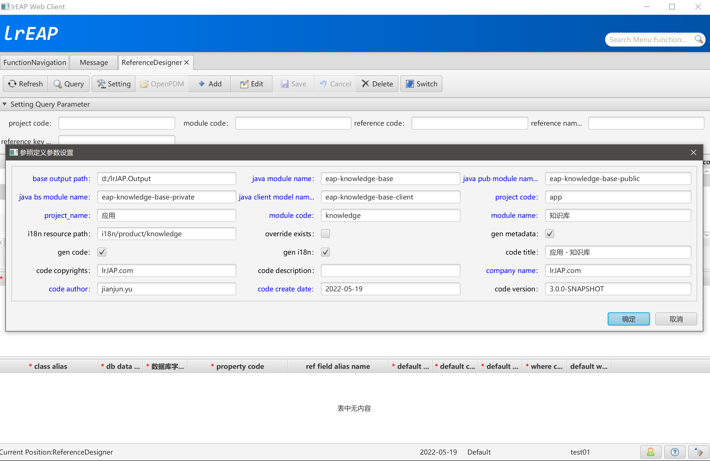
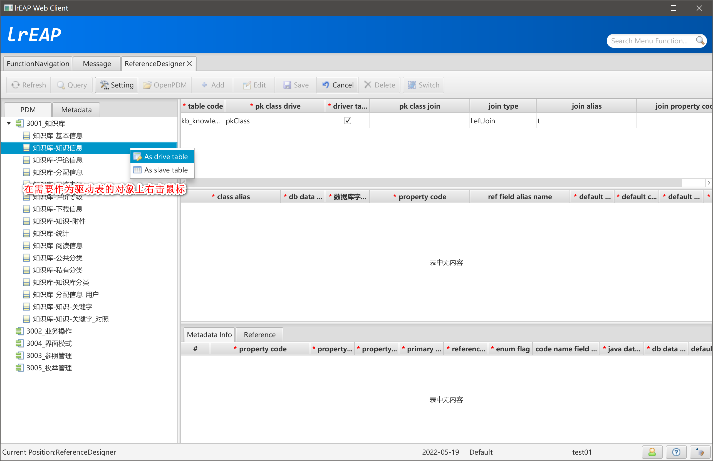
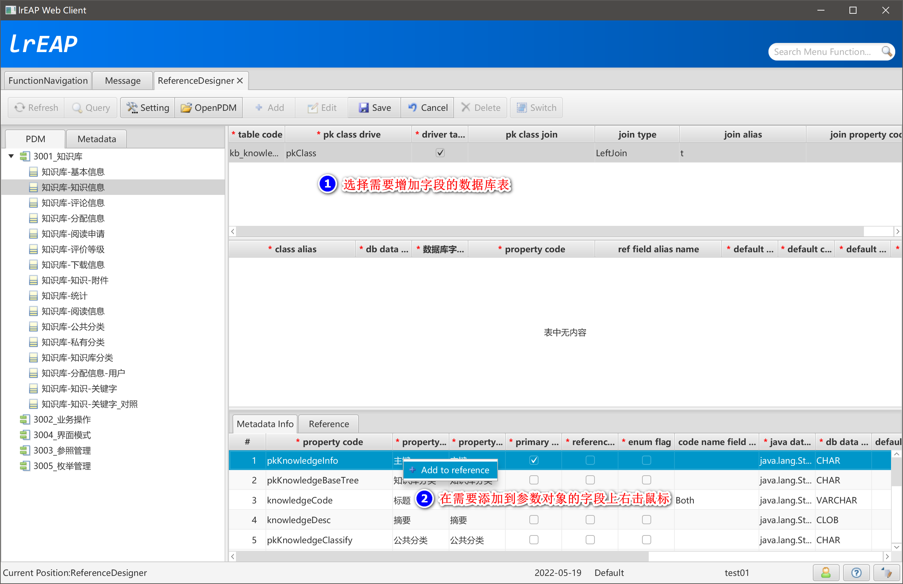
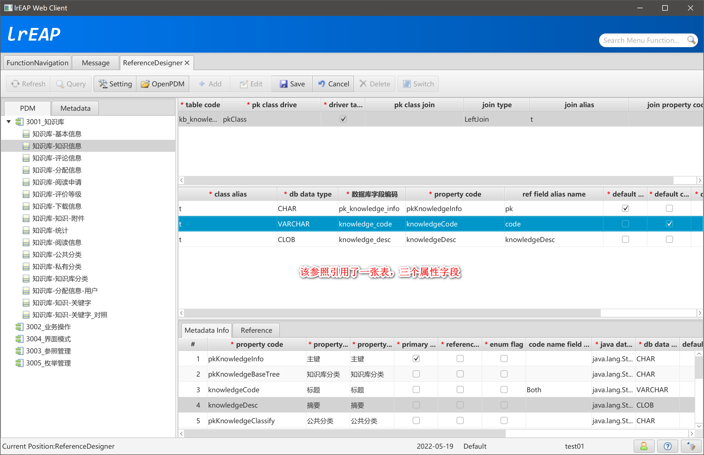
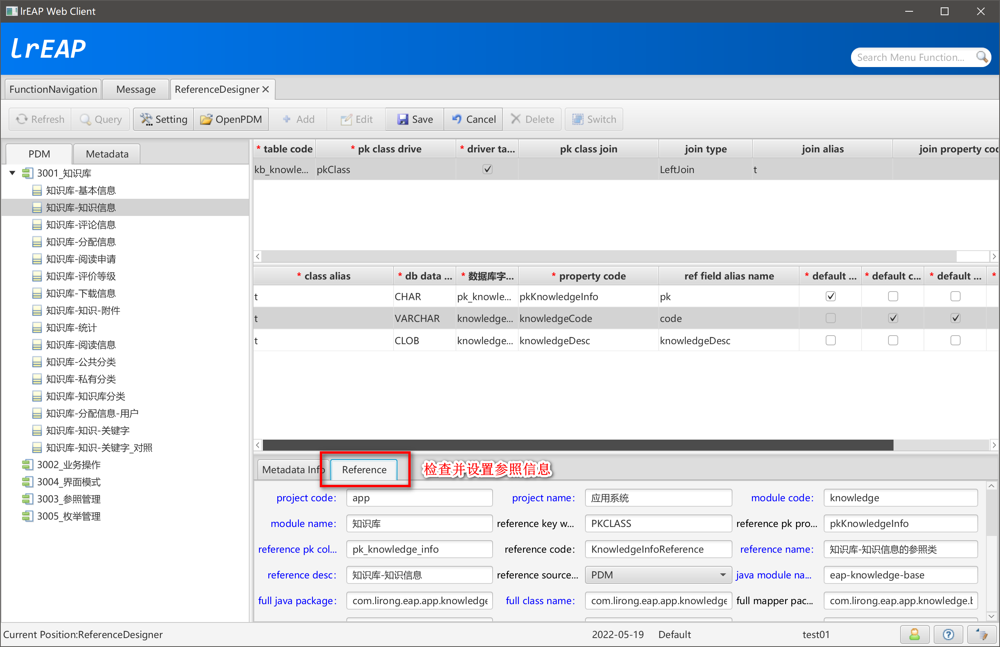
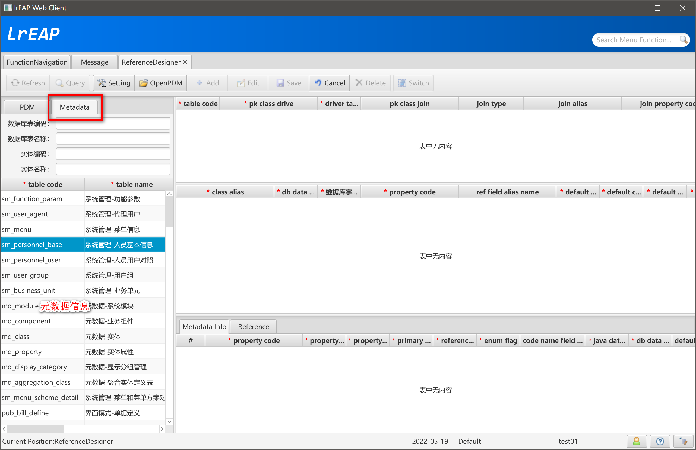

# Reference参照定义

[返回](../../README.md)

## 简述

参照用于描述当前对象（如对象A）对其它对象（如对象B/C…）的引用。具体到数据库层面来说，参照就是数据库表中外键引用（Foreign Key）在Java代码层面的映射。

我们在进行对象A的数据库设计时，对于对象B，在对象A中，把对象B的主键作为对象A表的外键保存。PowerDesigner中类似下图：

 

我们在PowerDesigner中设置使用蓝色字体显示外键，在模式化开发中，使用参照在代码层面实现对数据库外键的映射。

以“国家地区”字段为例，在“集团基本信息”表中，只是保存了当前集团所属的国家地区的主键（Primary Key）作为外键（Foreign Key）。但是在前台界面展现时，我们并不希望直接显示“国家地区”的主键，因为这对前台操作人员是没有实际业务意义的，而是希望看到“国家地区”的“编码”和“名称”信息。在界面上为集团指定国家地区时，也同理。

ReferenceDesigner支持通过PowerDesigner和元数据生成参照信息。在参照引用对象没有建立元数据信息时，可以通过基于PowerDesigner生成参照信息，待参照引用对象生成元数据后，再通过元数据生成参照信息。

## 基于PowerDesigner生成参照信息

### 参数设置



### 打开PDM文件


### 点击新增（Add）按钮


### 新增界面


### 增加驱动表



### 为参数添加数据库属性



### 完成参照设计



### 参照信息设置



### 保存参照信息

点击“保存”（Save）按钮，保存当前的参照信息，如果在“设置”中选中了生成代码，则相关资源将保存到输出目录中。

## 基于元数据信息生成参照信息

与基于PowerDesigner生成参照的方式类似，不同的是，不需要打开PDM，直接设置参数后，进行新增操作，基于元数据设计参照。



## 检查生成的参照资源信息

### 公共模块（eap-knowledge-base-public）

#### KnowledgeInfoReferenceVO

```java
/**
 * <p>Title: LiRong Java Enterprise Application Platform</p>
 * <p>应用 - 知识库</p>
 * Description: KnowledgeInfoReference 的参照类<br>
 * Copyright: lrJAP.com<br>
 * Company: lrJAP.com<br>
 *
 * @author jianjun.yu
 * @version 3.0.0-SNAPSHOT
 * @date 2022-05-19
 * @since 1.0.0-SNAPSHOT
 */
public class KnowledgeInfoReferenceVO extends ReferenceDataVO {

    private static final long serialVersionUID = 6704500477989441078L;

    public KnowledgeInfoReferenceVO() {

        super();
    }

    public KnowledgeInfoReferenceVO(String pk) {

        super(pk);
    }

    public KnowledgeInfoReferenceVO(String pk, String code, String name) {

        super(pk, code, name);
    }

    /******************************************************************************************************************/
    /********************************************** fxEAP Code Generator **********************************************/
    /******************************************************************************************************************/
}
```

#### IKnowledgeInfoReferenceModelService

```java
/**
 * <p>Title: LiRong Java Enterprise Application Platform</p>
 * <p>应用 - 知识库</p>
 * Description: KnowledgeInfoReference 的参照服务接口类<br>
 * Copyright: lrJAP.com<br>
 * Company: lrJAP.com<br>
 *
 * @author jianjun.yu
 * @version 3.0.0-SNAPSHOT
 * @date 2022-05-19
 * @since 1.0.0-SNAPSHOT
 */
public interface IKnowledgeInfoReferenceModelService<T extends KnowledgeInfoReferenceVO> extends IReferenceModelService<T> {

    String REFERENCE_SERVICE_NAME = "knowledgeInfoReferenceService"; // $NON-NLS$

    String REFERENCE_REMOTING_SERVICE_NAME = "/app-knowledge/knowledgeInfoReferenceHttpInvokerService"; // $NON-NLS$

    /**
     * 根据主键查询
     *
     * @param pk String
     * @return T
     * @throws BusinessException 业务异常
     */
    T queryReferenceByPrimaryKey(final String pk) throws BusinessException;

    /******************************************************************************************************************/
    /********************************************** fxEAP Code Generator **********************************************/
    /******************************************************************************************************************/
}
```

#### KnowledgeInfoReferenceModelService

```java
/**
 * <p>Title: LiRong Java Enterprise Application Platform</p>
 * <p>应用 - 知识库</p>
 * Description: KnowledgeInfoReference 参照的服务类<br>
 * Copyright: lrJAP.com<br>
 * Company: lrJAP.com<br>
 *
 * @author jianjun.yu
 * @version 3.0.0-SNAPSHOT
 * @date 2022-05-19
 * @since 1.0.0-SNAPSHOT
 */
@Service(IKnowledgeInfoReferenceModelService.REFERENCE_SERVICE_NAME)
public class KnowledgeInfoReferenceModelService implements IKnowledgeInfoReferenceModelService<KnowledgeInfoReferenceVO> {

    @Autowired
    private IKnowledgeInfoReferenceMapper knowledgeInfoReferenceMapper;

    @Override
    public Integer queryPaginationCount(Map<String, Object> params) throws BusinessException {

        return knowledgeInfoReferenceMapper.queryPaginationCount(params);
    }

    @Override
    public List<KnowledgeInfoReferenceVO> queryPaginationList(Map<String, Object> params) throws BusinessException {

        return knowledgeInfoReferenceMapper.queryPaginationList(params);
    }

    /**
     * 根据主键查询
     *
     * @param pk String
     * @return KnowledgeInfoReferenceVO
     * @throws BusinessException 业务异常
     */
    @Override
    public KnowledgeInfoReferenceVO queryReferenceByPrimaryKey(final String pk) throws BusinessException {

        if (StringUtils.isBlank(pk)) {
            throw new BusinessException("参数错误");
        }
        return knowledgeInfoReferenceMapper.queryReferenceByPrimaryKey(pk);
    }

    /******************************************************************************************************************/
    /********************************************** fxEAP Code Generator **********************************************/
    /******************************************************************************************************************/
}
```

### 业务处理模块（eap-knowledge-base-private）

#### IKnowledgeInfoReferenceMapper

```java
/**
 * <p>Title: LiRong Java Enterprise Application Platform</p>
 * <p>应用 - 知识库</p>
 * Description: KnowledgeInfoReference 的DAO类<br>
 * Copyright: lrJAP.com<br>
 * Company: lrJAP.com<br>
 *
 * @author jianjun.yu
 * @version 3.0.0-SNAPSHOT
 * @date 2022-05-19
 * @since 1.0.0-SNAPSHOT
 */
@Component
public interface IKnowledgeInfoReferenceMapper extends IBaseReferenceModelService {

    /**
     * 根据主键查询
     *
     * @param pk String
     * @return KnowledgeInfoReferenceVO
     * @throws BusinessException 业务异常
     */
    KnowledgeInfoReferenceVO queryReferenceByPrimaryKey(final String pk) throws BusinessException;

    /******************************************************************************************************************/
    /********************************************** fxEAP Code Generator **********************************************/
    /******************************************************************************************************************/
}
```

#### IKnowledgeInfoReferenceMapper

```xml
<?xml version="1.0" encoding="UTF-8" ?>
<!DOCTYPE mapper PUBLIC "-//mybatis.org//DTD Mapper 3.0//EN" "http://mybatis.org/dtd/mybatis-3-mapper.dtd">

<mapper namespace="com.lirong.eap.app.knowledge.bs.dao.reference.IKnowledgeInfoReferenceMapper">

    <resultMap type="com.lirong.eap.app.knowledge.pub.vo.reference.KnowledgeInfoReferenceVO" id="KnowledgeInfoReferenceVO"
               extends="com.lirong.eap.platform.PaginationResultCounterMapper.PaginationResultCounter">
        <!-- 主键 -->
        <id property="pk" column="pk"/>

        <!-- 编码 -->
        <result property="code" column="code" javaType="java.lang.String" jdbcType="VARCHAR"/>
        <!-- 名称 -->
        <result property="name" column="name" javaType="java.lang.String" jdbcType="VARCHAR"/>

    </resultMap>

    <!-- 知识库-知识信息的参照类 分页查询.获取数据 Oracle -->
    <select id="queryPaginationList" resultMap="KnowledgeInfoReferenceVO" parameterType="HashMap" databaseId="oracle" flushCache="true">
        <include refid="com.lirong.eap.app.knowledge.bs.dao.reference.IKnowledgeInfoReferenceMapper.queryPaginationOracleDB2"/>
    </select>

    <!-- 知识库-知识信息的参照类 分页查询.获取数据 DB2 -->
    <select id="queryPaginationList" resultMap="KnowledgeInfoReferenceVO" parameterType="HashMap" databaseId="db2" flushCache="true">
        <include refid="com.lirong.eap.app.knowledge.bs.dao.reference.IKnowledgeInfoReferenceMapper.queryPaginationOracleDB2"/>
    </select>

    <!-- 知识库-知识信息的参照类 分页查询.获取数据 MySQL -->
    <select id="queryPaginationList" resultMap="KnowledgeInfoReferenceVO" parameterType="HashMap" databaseId="mysql" flushCache="true">
        <include refid="com.lirong.eap.app.knowledge.bs.dao.reference.IKnowledgeInfoReferenceMapper.queryPaginationMySQL"/>
    </select>

    <!-- 知识库-知识信息的参照类 分页查询.获取总行数 -->
    <!-- @formatter:off -->
    <select id="queryPaginationCount" resultType="int" parameterType="HashMap" flushCache="true">
select
  count(*)
from kb_knowledge_info t
<include refid="com.lirong.eap.app.knowledge.bs.dao.reference.IKnowledgeInfoReferenceMapper.ref_table_join"/>
<include refid="com.lirong.eap.app.knowledge.bs.dao.reference.IKnowledgeInfoReferenceMapper.query_condition"/>
    </select>
    <!-- @formatter:on -->

    <!-- 知识库-知识信息的参照类 根据外键获取参照信息 -->
    <!-- @formatter:off -->
    <select id="queryReferenceByPrimaryKey" resultMap="KnowledgeInfoReferenceVO" parameterType="String" flushCache="true">
select
  <include refid="com.lirong.eap.app.knowledge.bs.dao.reference.IKnowledgeInfoReferenceMapper.select_ref_fields"/>
  <include refid="com.lirong.eap.app.knowledge.bs.dao.reference.IKnowledgeInfoReferenceMapper.mainFieldList"/>
from kb_knowledge_info t
<include refid="com.lirong.eap.app.knowledge.bs.dao.reference.IKnowledgeInfoReferenceMapper.ref_table_join"/>
where t.pk_knowledge_info = #{pkKnowledgeInfo, jdbcType=CHAR}
    </select>
    <!-- @formatter:on -->

    <!-- pk/code/name的字段列表 -->
    <!-- @formatter:off -->
    <sql id="mainFieldList">
  t.pk_knowledge_info pk,
  t.knowledge_code code
    </sql>
    <!-- @formatter:on -->

    <!-- @formatter:off -->
    <sql id="queryPaginationOracleDB2">
select * from (
  select
    sum(1) over() dataCounter,
    row_number() over (order by t.pk_knowledge_info) rn,
    <include refid="com.lirong.eap.app.knowledge.bs.dao.reference.IKnowledgeInfoReferenceMapper.select_ref_fields"/>
    <include refid="com.lirong.eap.app.knowledge.bs.dao.reference.IKnowledgeInfoReferenceMapper.mainFieldList"/>
  from kb_knowledge_info t
  <include refid="com.lirong.eap.app.knowledge.bs.dao.reference.IKnowledgeInfoReferenceMapper.ref_table_join"/>
  <include refid="com.lirong.eap.app.knowledge.bs.dao.reference.IKnowledgeInfoReferenceMapper.query_condition"/>
) a where rn &lt;= (#{pageIndex} * #{pageSize}) and rn &gt;= ((#{pageIndex} - 1) * #{pageSize} + 1)
    </sql>
    <!-- @formatter:on -->

    <!-- @formatter:off -->
    <sql id="queryPaginationMySQL">
select
  <include refid="com.lirong.eap.app.knowledge.bs.dao.reference.IKnowledgeInfoReferenceMapper.select_ref_fields"/>
  <include refid="com.lirong.eap.app.knowledge.bs.dao.reference.IKnowledgeInfoReferenceMapper.mainFieldList"/>
from kb_knowledge_info t
<include refid="com.lirong.eap.app.knowledge.bs.dao.reference.IKnowledgeInfoReferenceMapper.ref_table_join"/>
<include refid="com.lirong.eap.app.knowledge.bs.dao.reference.IKnowledgeInfoReferenceMapper.query_condition"/>
order by t.pk_knowledge_info
limit #{pageBeginIndex}, #{pageEndIndex}
    </sql>
    <!-- @formatter:on -->

    <!-- 生成Reference的所有字段信息 -->
    <!-- @formatter:off -->
    <sql id="select_ref_fields">

    </sql>
    <!-- @formatter:on -->

    <!-- 生成Reference SQL表联接 -->
    <!-- @formatter:off -->
    <sql id="ref_table_join">

    </sql>
    <!-- @formatter:on -->

    <!-- 生成SQL查询条件 -->
    <sql id="query_condition">
        <where>
            <if test="pk_knowledge_info != null and pk_knowledge_info != ''">
                and t.pk_knowledge_info = #{pkKnowledgeInfo, jdbcType=CHAR}
            </if>
            <if test="knowledge_code != null and knowledge_code != ''">
                and t.knowledge_code like concat('%', concat(#{knowledgeCode, jdbcType=VARCHAR}, '%'))
            </if>
        </where>
    </sql>
</mapper>
```

### 前端模块（eap-knowledge-base-client）

#### KnowledgeInfoReferenceAppModel

```java
/**
 * <p>Title: LiRong Java Enterprise Application Platform</p>
 * <p>应用 - 知识库</p>
 * Description: KnowledgeInfoReference 参照的界面Model类<br>
 * Copyright: lrJAP.com<br>
 * Company: lrJAP.com<br>
 *
 * @author jianjun.yu
 * @version 3.0.0-SNAPSHOT
 * @date 2022-05-19
 * @since 1.0.0-SNAPSHOT
 */
public class KnowledgeInfoReferenceAppModel<T extends KnowledgeInfoReferenceVO> extends AbstractReferenceTableAppModel<T> {

    private IKnowledgeInfoReferenceModelService knowledgeInfoReferenceModelService = DefaultApplicationContextUtils.getBean(IKnowledgeInfoReferenceModelService.REFERENCE_SERVICE_NAME);

    public KnowledgeInfoReferenceAppModel() {

        super("PK_KNOWLEDGE_INFO"); // $NON-NLS$
    }

    @Override
    public IKnowledgeInfoReferenceModelService getReferenceModelService() {

        return this.knowledgeInfoReferenceModelService;
    }

    @Override
    public KnowledgeInfoReferenceVO createQueryVO() {

        return new KnowledgeInfoReferenceVO();
    }

    /******************************************************************************************************************/
    /********************************************** fxEAP Code Generator **********************************************/
    /******************************************************************************************************************/
}
```

#### KnowledgeInfoReferenceClientConfig

```java
/**
 * <p>Title: LiRong Java Enterprise Application Platform</p>
 * <p>应用 - 知识库</p>
 * Description: KnowledgeInfoReference 参照的ClientConfig类<br>
 * Copyright: lrJAP.com<br>
 * Company: lrJAP.com<br>
 *
 * @author jianjun.yu
 * @version 3.0.0-SNAPSHOT
 * @date 2022-05-19
 * @since 1.0.0-SNAPSHOT
 */
@Configuration
public class KnowledgeInfoReferenceClientConfig {

    @Bean(IKnowledgeInfoReferenceModelService.REFERENCE_SERVICE_NAME)
    public JAPHttpInvokerProxyFactoryBean knowledgeInfoReferenceModelService() {

        return createHttpInvokerPropertyFactoryBean(IKnowledgeInfoReferenceModelService.REFERENCE_REMOTING_SERVICE_NAME, IKnowledgeInfoReferenceModelService.class);
    }

    @Bean
    @Scope(ConfigurableBeanFactory.SCOPE_PROTOTYPE)
    public ReferenceDialog knowledgeInfoReferenceDialog() {

        KnowledgeInfoReferencePane referencePane = new KnowledgeInfoReferencePane();
        referencePane.adapter();
        ReferenceDialog referenceDialog = new ReferenceDialog(referencePane);
        return referenceDialog;
    }

    /******************************************************************************************************************/
    /********************************************** fxEAP Code Generator **********************************************/
    /******************************************************************************************************************/
}
```

#### KnowledgeInfoReferencePane

```java
/**
 * <p>Title: LiRong Java Enterprise Application Platform</p>
 * <p>应用 - 知识库</p>
 * Description: KnowledgeInfoReference 参照的界面容器类<br>
 * Copyright: lrJAP.com<br>
 * Company: lrJAP.com<br>
 *
 * @author jianjun.yu
 * @version 3.0.0-SNAPSHOT
 * @date 2022-05-19
 * @since 1.0.0-SNAPSHOT
 */
public class KnowledgeInfoReferencePane<T extends KnowledgeInfoReferenceVO> extends AbstractReferenceTablePane<T> {

    public KnowledgeInfoReferencePane() {

        super();
        setAppModel(new KnowledgeInfoReferenceAppModel());
    }

    @Override
    public KnowledgeInfoReferenceVO getSelectValue() {

        return (KnowledgeInfoReferenceVO) super.getSelectValue();
    }

    @Override
    public void adapter() {

        getAppModel().afterPropertiesSet();
        afterPropertiesSet();
        getPaginationToolbar().afterPropertiesSet();
    }

    @Override
    public void handleEvent(AppModelEvent event) {

        super.handleEvent(event);
    }

    /******************************************************************************************************************/
    /********************************************** fxEAP Code Generator **********************************************/
    /******************************************************************************************************************/
}
```


[返回](../../README.md)
